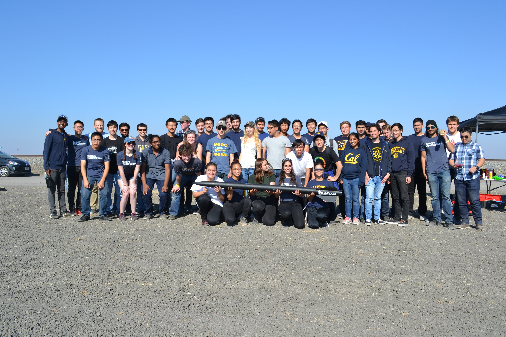
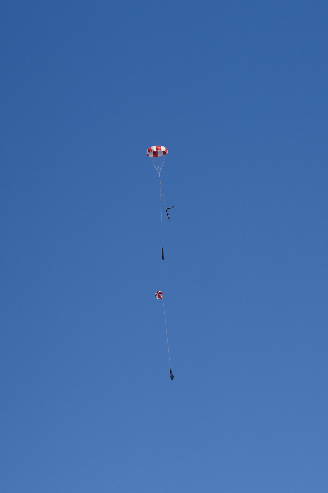

# 2019-11-16 Airbears

The first flight of Airbears constituted the largest launch we have had to date in terms of amount of members in attendance with a total of 47 members.

Launch logistics were well organized with the a spreadsheet with assigned drivers and seats. Moving forward however, we should have contingencies in place for when drivers do not show up/wake up on time for launches.

We arrived at TCC around 9 am and were able to get fully set up by 10 pm.

Recovery ground test originally used wire crimps but because the crimps were finicky and hard to get on, they were abandoned later. Ground test consisted of the use of 2 one gram black powder charges. The drogue chute deployed very well however, the main chute tube had separation of only a few inches so we sized up to 2 gram black powder charges for both sides and performed a second ground test. This one went well, only testing the main parachute side with complete separation. 

Ground test 2 video: [https://drive.google.com/file/d/1EIZnwMlhGFCPrsdd58aA63Z8x0X2OzbJ/view](https://drive.google.com/file/d/1EIZnwMlhGFCPrsdd58aA63Z8x0X2OzbJ/view)

It must be noted that the scale we brought to use was not working well and failed to measure therefore black powder charges were measured based on volume of vial and not actual weight. We will look into getting a new scale.

\[payload and avionics\]

Once the payload, avionics, and sims altimeters were all mounted into the payload section, the many sections of the rocket were screwed together with airframe sheet metal screws and sheer pins. Everything closed properly but the main parachute was a bit tight. 

Pictures were taken both before going out to the launchpad and on the launchpad. Once the pictures were taken, all non-essential personnel were asked to leave the launchpad and the rocket was armed. Recovery altimeters were nominal and the sims altimeter was reconnected once again through one of the pressure holes.

Airbears flew well going up to 4509 ft apogee. This was incredibly close to the projected apogee of 4500 ft. The two recovery altimeters recorded 4508 and 4509 ft respectively. Drogue deployed at apogee and the main parachute deployed at 800 ft. There was very little wind thus the parachute drifted very close to the original launch location around 100 meters away. All black powder was fully burned off.

\[payload and avionics\]

Slight burns were noticed on all of the parachutes likely because of poor parachute bag sizing and the black powder charges ended up being quite large.

