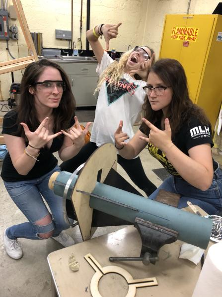

# Attaching Fins

## **Fin Jig** 

Fins can be attached with a fin jig. This method involves epoxying the fins onto the motor mount, at equal spacing, through slits made on the main booster tube. We ensure that the fins stay perpendicular to the airframe by using a fin jig: a lasercut "spacer" that holds the fins in place while the epoxy dries.  

Fin jigs are used for fin sizes where epoxy adhesion is sufficient. For larger or heavier fins \(here we used fiberglass\), it might be best to use fin brackets.

To be added later: scematic of fin jig \(emphasis on the hole for the rail button\), epoxy used, carbon fiber fillets, circle clamp, sanding fillets.

## Fin Brackets

As stated above, fin brackets are convenient for larger and heavier fins where epoxy is not strong enough. A fin bracket is typically an L-bracket that gets bolted into the side of the fin and the airframe. We have not had to use fin brackets yet.

## Fin Can

A fin can is a single-piece setup that includes all the fins attached to a cylinder that slides onto the booster tube. We have also never used this method. 

