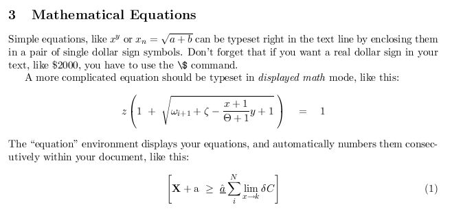
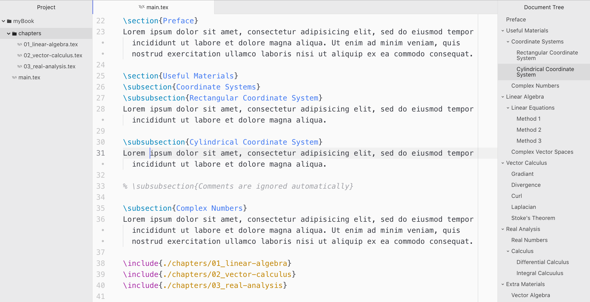

# LaTeX

## What is $$\LaTeX$$?

$$\LaTeX$$ is a typesetting system, much like Microsoft Word or Adobe InDesign. It is **not** a text editor.$$\LaTeX$$ is used widely in the scientific and technical publishing industry; if you've seen a document that looks like the picture below, chances are it was written in $$\LaTeX$$.

While $$\LaTeX$$documents come in all sorts of flavors, they generally share a similar appearance because they use the [Computer Modern](https://en.wikipedia.org/wiki/Computer_Modern) typeface. However, all the fonts, colors, layouts and pretty much everything is customizable--$$\LaTeX$$is a way of "programming documents".

While Microsoft Word is a "What You See Is What You Get" \(WYSIWYG\) system, $$\LaTeX$$is decidedly not. Instead, $$\LaTeX$$is written as code \(see below\), and then compiled, usually into a PDF.

## Why should I use $$\LaTeX$$?

The most common reason to use $$\LaTeX$$is because you are writing a document with equations in it. There is simply no other way to get beautifully formatted equations \(although many programs like Word now support $$\LaTeX$$syntax\).

Even if you don't have equations, $$\LaTeX$$allows writers to stop worrying about annoying formatting issues, breaking their document when they add a picture, etc. and focus on the actual content. Documents like reports and books can be written in sections and seamlessly re-compiled using the `article`and`book`classes, while the formatting and numbering of tables, figures, references, citations, footnotes, etc. are taken care of completely automatically. 

To give one example, if you have 5 figures labeled Fig. 1 through Fig. 5, you can insert a figure between Fig. 1 and Fig 2. and not have to worry about changing the references to Figs. 2-5 to Figs. 3-6. This can save an enormous amount of time when writing longer documents.

## How do I use $$\LaTeX$$?

There are two ways to use $$\LaTeX$$: locally on your computer or in the \*cloud\*.

### Locally

This is really for hardcore users and people without internet. You'll first need to install a version of $$\LaTeX$$compatible with your operating system. Head over to [https://www.latex-project.org/get/](https://www.latex-project.org/get/) to get started; we recommed TeX Live for Linux, MacTeX for macOS, and MiKTeX for Windows. These downloads can be pretty big!

As mentioned previously, $$\LaTeX$$is a typesetting system, **not** an editor. You can write $$\LaTeX$$documents in Atom, Sublime, Notepad, Notepad++, vim, Emacs, ex, TextEdit, or whatever text editor you can get your hands on. That being said, TeXnicCenter and TeXstudio are popular editors for Windows, and MacTeX includes TeXShop; you might want to use these or similar TeX-oriented editors to edit your documents unless you know what you're doing. Linux users can choose from [10s of options](https://www.ubuntupit.com/best-latex-editor-top-33-reviewed-for-linux-nerds/); for some reason people who are into Linux are also into TeX.

### In the Cloud

Welcome to the future. Simply head over to [https://www.overleaf.com/](https://www.overleaf.com/) \(now merged with ShareLaTeX\) to get started! [UC Berkeley provides free Overleaf Professional](https://www.overleaf.com/edu/berkeley) with a verified berkeley.edu email address. Overleaf has hundreds of great [templates ](https://www.overleaf.com/latex/templates)and [tutorials](https://www.overleaf.com/learn) to help you get started.

### A Short Tutorial

While there are hundreds of tutorials on the internet, this one is pretty good: [https://www.overleaf.com/learn/latex/Learn\_LaTeX\_in\_30\_minutes](https://www.overleaf.com/learn/latex/Learn_LaTeX_in_30_minutes). When in doubt, just Google! Chances are someone's had the same question and made a StackOverflow post about it.

## What does CalSTAR use $$\LaTeX$$ for?

We have previously used $$\LaTeX$$to compile our reports for NASA Student Launch. If you ever need to make a checklist, design document, or report, feel free to use $$\LaTeX$$. Generally, Google Docs is a little easier for the uninitiated, but don't be afraid to make your documents look nice!

